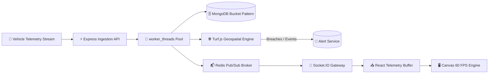

<div align="center">

# ⚡ FleetDash

### *High-Throughput Event-Driven Fleet Telemetry Platform*

[](https://github.com/Mannsoni8/intership-infotec/tree/mann)
[](https://www.typescriptlang.org/)
[](https://nodejs.org/)
[](https://react.dev/)
[](https://www.mongodb.com/)
[](https://redis.io/)
[](https://socket.io/)
[](https://github.com/Mannsoni8/intership-infotec)

<p align="center">
  <b>Real-time high-frequency GPS tracking, automated geospatial geofencing, time-series telemetry bucketing, and smooth 60 FPS hardware-accelerated dashboard rendering.</b>
</p>

---

</div>

## 📌 1. Project Overview

**FleetDash** is an enterprise-grade, event-driven fleet telemetry and monitoring system designed to handle high-frequency location and sensor streams across extensive vehicle fleets.

Built with scalability and strict type safety at its core, FleetDash decouples intensive ingestion from analytical processing and client fanout:
- **High-Frequency Ingestion**: Processes dense telemetry streams without blocking event loops.
- **Time-Series Optimization**: Implements MongoDB's **Bucket Pattern** to compress and aggregate hourly vehicle readings into single documents.
- **Spatial Intelligence**: Real-time evaluation of circular and polygonal geofence breaches via Turf.js.
- **Real-Time Distribution**: Redis Pub/Sub broker powering distributed WebSocket broadcasting.
- **60 FPS Hardware-Accelerated UI**: Custom telemetry client-side ring buffers driving HTML5 Canvas rendering via `requestAnimationFrame`.

---

## 🏗️ 2. System Architecture

FleetDash follows a decoupled, asynchronous ingestion and fanout pipeline:



### Ingestion & Processing Pipeline
1. **Vehicle Telemetry** sends continuous location and telemetry payloads (`lat`, `lng`, `speed`, `heading`, `batteryLevel`, `fuelLevel`).
2. **Express Ingestion API** validates incoming schema without synchronous database bottlenecks.
3. **`worker_threads` Pool** offloads heavy compute, serialization, and stream validation from the main thread.
4. **MongoDB Bucket Pattern** compacts 1-hour batches of telemetry into single structured documents to minimize index overhead and write I/O.
5. **Turf.js Geospatial Engine** performs sub-millisecond point-in-polygon and circle proximity checks for active geofences.
6. **Redis Pub/Sub** broadcasts state updates across horizontally scalable backend nodes.
7. **Socket.IO** streams events to connected operator clients in real-time.
8. **React Telemetry Buffer + HTML5 Canvas** interpolates positions smoothly using `requestAnimationFrame` for buttery 60 FPS rendering.

---

## 🛠️ 3. Technology Stack

| Layer | Technologies | Purpose |
| :--- | :--- | :--- |
| **Backend Runtime** | Node.js (ES Modules), TypeScript (Strict) | High-performance asynchronous execution with total type safety |
| **HTTP Framework** | Express 5 | Ingestion endpoints, REST APIs, and middleware pipelines |
| **Database & Storage** | MongoDB, Mongoose 9 | Time-series vehicle telemetry bucketing and relational metadata storage |
| **Message Broker** | Redis Pub/Sub | Distributed real-time inter-service message distribution |
| **Concurrency** | Node.js `worker_threads` | CPU-intensive spatial calculations and parallel stream ingestion |
| **Geospatial Engine**| Turf.js | Precision geofence containment, point-in-polygon, and distance math |
| **Real-time Web** | Socket.IO | Bi-directional, low-latency live telemetry & alert streaming |
| **Frontend UI** | React 19, TypeScript, Vite | Reactive monitoring cockpit, telemetry buffers, and state management |
| **Data Visualization**| HTML5 Canvas API, `requestAnimationFrame` | High-density 60 FPS fleet map and telemetry rendering |

---

## 📁 4. Repository Structure

```
intership-infotec/
├── .claude/
│   └── CLAUDE.md                     # Project engineering guidelines & development rules
├── client/                           # React 19 + TypeScript frontend (Vite)
│   ├── public/                       # Static public assets
│   ├── src/
│   │   ├── assets/                   # UI graphics & icons
│   │   ├── App.tsx                   # Main dashboard component
│   │   ├── App.css
│   │   ├── index.css
│   │   └── main.tsx                  # Client entrypoint
│   ├── package.json
│   ├── tsconfig.json
│   └── vite.config.ts
├── server/                           # Express 5 + TypeScript backend
│   ├── src/
│   │   ├── config/
│   │   │   ├── database.ts           # MongoDB connection handler
│   │   │   ├── env.ts                # Environment variable parsing & validation
│   │   │   └── redis.ts              # Redis client configuration
│   │   ├── controllers/              # Express request/response controllers
│   │   │   ├── geofence.controller.ts
│   │   │   ├── telemetry.controller.ts
│   │   │   └── vehicle.controller.ts
│   │   ├── geospatial/               # Spatial calculations & rule engines
│   │   │   ├── geofence.engine.ts
│   │   │   └── turf.service.ts
│   │   ├── middleware/               # Express middlewares (Validation, Error, 404)
│   │   │   ├── error.middleware.ts
│   │   │   ├── not-found.middleware.ts
│   │   │   └── validation.middleware.ts
│   │   ├── models/                   # Mongoose data schemas
│   │   │   ├── alert.model.ts        # System alerts & breach records
│   │   │   ├── geofence.model.ts     # Polygon & Circle geofence zones
│   │   │   ├── telemetry.model.ts    # MongoDB Bucket Pattern schema
│   │   │   └── vehicle.model.ts      # Fleet vehicle metadata & state
│   │   ├── pubsub/                   # Redis message broker
│   │   │   ├── publisher.ts
│   │   │   └── subscriber.ts
│   │   ├── routes/                   # REST API route definitions
│   │   │   ├── geofence.routes.ts
│   │   │   ├── telemetry.routes.ts
│   │   │   └── vehicle.routes.ts
│   │   ├── services/                 # Business logic layer
│   │   │   ├── alert.service.ts
│   │   │   ├── geofence.service.ts
│   │   │   ├── telemetry.service.ts  # Bucket aggregation & time-range queries
│   │   │   └── vehicle.service.ts
│   │   ├── types/                    # Strict TypeScript interfaces & type definitions
│   │   │   ├── alert.types.ts
│   │   │   ├── geofence.types.ts
│   │   │   ├── telemetry.types.ts
│   │   │   └── vehicle.types.ts
│   │   ├── utils/                    # Shared constants, custom errors & logging
│   │   │   ├── constants.ts
│   │   │   ├── errors.ts
│   │   │   └── logger.ts
│   │   ├── websocket/                # Socket.IO handlers
│   │   │   ├── alert.socket.ts
│   │   │   ├── socket.server.ts
│   │   │   └── telemetry.socket.ts
│   │   ├── workers/                  # Background thread workers
│   │   │   ├── telemetry.worker.ts
│   │   │   └── worker-pool.ts
│   │   ├── app.ts                    # Express application setup
│   │   └── server.ts                 # Server initialization & entrypoint
│   └── package.json
└── README                            # Project documentation
```

---

## 📊 5. Current Implementation Progress

| Component / Subsystem | Status | Details |
| :--- | :---: | :--- |
| **Strict Type System** | ✅ **Complete** | Full interfaces for `Vehicle`, `TelemetryBucket`, `Geofence`, and `Alert` |
| **Mongoose Data Models** | ✅ **Complete** | Complete schemas with compound indexes and validation rules |
| **Telemetry Bucket Logic** | ✅ **Complete** | Hourly time bucketing (`getBucketStart`, `addTelemetryReading`, `getTelemetryByTimeRange`) |
| **Database Connection** | ✅ **Complete** | Safe MongoDB async connection with typed returns and error logging |
| **Vehicle Service Layer** | 🔄 *In Progress* | Vehicle registration, metadata querying, and status updates |
| **API Endpoints & Validation** | ⏳ *Planned* | Express routers and strict schema validation middleware |
| **Geospatial & Turf Engine** | ⏳ *Planned* | Dynamic polygon and radius containment checks for active fleets |
| **Worker Threads Ingestion** | ⏳ *Planned* | Multi-threaded telemetry deserialization and validation pool |
| **Redis Pub/Sub & WebSockets** | ⏳ *Planned* | Distributed message distribution and live client fanout |
| **Canvas 60 FPS Telemetry UI** | ⏳ *Planned* | Client-side interpolation buffer and canvas rendering engine |

---

## 🎯 6. Performance Targets

- **Ingestion Latency:** `< 50ms` from ingestion endpoint to worker distribution.
- **Geofence Processing:** `< 5ms` per coordinate validation against active geospatial zones via Turf.js.
- **Database Write Optimization:** **>80% reduction** in document growth and indexing overhead via MongoDB Bucket Pattern.
- **Client Rendering:** Consistent **60 FPS** UI animation using hardware-accelerated HTML5 Canvas and `requestAnimationFrame`.
- **WebSocket Throughput:** Sub-100ms end-to-end telemetry propagation from ingest to UI.

---

## 🌿 7. Development & Git Workflow

### Active Branch
All active feature development and daily work must take place exclusively on:
```bash
git checkout mann
```
> ⚠️ **Notice:** Branch `mann-daily` is strictly prohibited.

### Commit Standards
All commits must follow **Conventional Commits**:
- `feat: <description>` — New user-facing or architectural functionality
- `fix: <description>` — Bug fixes
- `refactor: <description>` — Code reorganization without functional changes
- `test: <description>` — Addition or correction of tests
- `docs: <description>` — Documentation updates
- `chore: <description>` — Tooling, dependency, and configuration maintenance

### Engineering Standards
- **Strict TypeScript:** No `any` types permitted.
- **Zero Broken Commits:** Every commit must be fully verified and functional.
- **Modular Codebase:** Clean separation of concerns between ingestion, services, geospatial engines, and presentation layers.

---

## 🔒 8. Security & Secret Hygiene

To prevent data leaks and protect infrastructure credentials:

- **Never Commit Sensitive Files:**
  - `.env`, `.env.*`, `.env.local`, `.env.production`
  - Private keys, API keys, tokens, MongoDB connection strings, Redis credentials, and certificates.
- **Allowed:** `.env.example` containing descriptive placeholder keys only.
- **Pre-Commit Verification Routine:**
  ```bash
  git status
  git diff --staged
  ```
  *Verify that no environment files or sensitive secrets are staged before committing.*

---

<div align="center">

```
================================================================================
   ⚡ FLEETDASH  •  HIGH-THROUGHPUT REAL-TIME TELEMETRY ENGINE  •  2026 ⚡
================================================================================
```

<sub>Built with precision for high-concurrency fleet intelligence.</sub>

</div>
