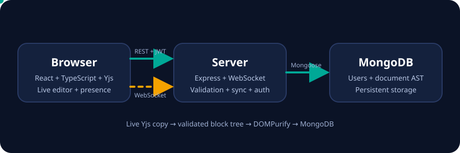

# SyncDoc

<p align="center">
  <a href="https://github.com/">
    
  </a>
</p>

<p align="center">
  
</p>

<p align="center">
  A block-based document editor where multiple people can edit the same document at the same time without overwriting each other's work.
</p>

<p align="center">
  
  
  
  
  
  
</p>

---

## Architecture

SyncDoc has two communication paths from the browser to the server: REST for application operations and WebSocket/Yjs for real-time collaboration.

<p align="center">
  
</p>

### Request flow

```text
┌──────────────────────┐
│       Browser        │
│   React + Yjs        │
└──────────┬───────────┘
           │
     ┌─────┴─────┐
     │           │
 REST + JWT   WebSocket
     │           │
     └─────┬─────┘
           ▼
┌──────────────────────┐
│       Server         │
│   Express + ws       │
└──────────┬───────────┘
           │
       Mongoose
           ▼
┌──────────────────────┐
│       MongoDB        │
│ users + block tree   │
└──────────────────────┘
```

**Autosave flow:** live Yjs copy → block tree → DOMPurify → MongoDB

---

## Tech Stack

| Layer | Technology |
|---|---|
| Frontend | React, TypeScript, Vite |
| Backend | Node.js, Express |
| Database | MongoDB, Mongoose |
| Real-time | WebSocket (`ws`), Yjs CRDT |
| Authentication | JWT, bcrypt |
| Security | Helmet, rate limiting, DOMPurify |
| Export | PDFKit, HTML, Markdown |
| Testing | Jest, Supertest, Vitest |

---

## Features

- Real-time multi-user document editing with Yjs.
- Block-based document editor.
- Recursive AST stored in MongoDB.
- WebSocket rooms for collaborative editing.
- Live presence and cursors.
- Block locking and editing indicators.
- Autosave every 2 seconds.
- Markdown import and export.
- HTML and PDF export.
- Document sharing and collaborator management.
- DOMPurify sanitization before persistence.
- JWT authentication.
- Password hashing with bcrypt.
- Rate limiting for authentication and API requests.
- Security headers with Helmet.
- Protected REST and WebSocket document access.
- Unit, synchronization, and API integration tests.

---

## How to Run

### Requirements

- Node.js 18+
- MongoDB or MongoDB Atlas

### Installation

```bash
cd syncdoc
npm install
npm run setup
npm run seed
```

`npm run setup` creates `server/.env` with a random JWT secret.

### Start the server

Terminal 1:

```bash
npm run dev:server
```

Server:

```text
http://localhost:5000
```

### Start the client

Terminal 2:

```bash
npm run dev:client
```

Client:

```text
http://localhost:5173
```

### Demo accounts

After running:

```bash
npm run seed
```

Use:

```text
alice@example.com
bob@example.com
```

Password:

```text
Password123!
```

> Each browser tab keeps its own session, so you can log in as Alice in one tab and Bob in another.

---

## Collaboration Demo

Open the application in two tabs and use the two demo accounts.

```text
Alice                         Bob
  │                            │
  │──── edits document ───────►│
  │                            │
  │◄─── remote cursor ─────────│
  │                            │
  │──── block update ─────────►│
  │                            │
  └──── same final document ───┘
```

The collaboration UI demonstrates:

- Remote caret
- Live cursor
- Block lock badge
- Presence
- Remote changes
- Changed-block flash
- Conflict-free merging

---

## Editor Shortcuts

| Shortcut | Action |
|---|---|
| `Enter` | Create a new block |
| `Tab` | Indent a list item |
| `Shift + Tab` | Outdent a list item |
| `Backspace` | Delete an empty block |
| Arrow keys | Move between blocks |

---

## Development Progress

<details open>
<summary><strong>Week 1 — AST model and document UI</strong></summary>

- Nested Mongoose schema.
- Recursive pre-save validation.
- Unique block IDs.
- Maximum depth validation.
- List-rule validation.
- Automatic `parentId`, `depth`, and `path`.
- React document list.
- Create, import, and delete documents.
- Block components for each document type.

</details>

<details open>
<summary><strong>Week 2 — Real-time engine</strong></summary>

- WebSocket server with Yjs rooms.
- Presence tracking.
- Block locking.
- Autosave every 2 seconds.
- MongoDB persistence.
- Restart-safe document storage.

</details>

<details open>
<summary><strong>Mid-project review</strong></summary>

- Markdown ↔ JSON AST mapping.
- Markdown import and export.
- Ten concurrent-client synchronization test.
- All clients finish with the same document.
- Remote changes transform the caret so typing is not corrupted.

</details>

<details open>
<summary><strong>Week 3 — Export and cursors</strong></summary>

- PDF export.
- HTML export.
- Markdown export.
- HTML escaping and sanitization.
- Content Security Policy for exported HTML.
- Atomic cursor state with `CursorContext`.
- `React.memo` optimization for block rendering.

</details>

<details open>
<summary><strong>Week 4 — Security and live cursors</strong></summary>

- DOMPurify sanitizes every block before saving.
- Live cursors and selections.
- User names and cursor colors.
- Yjs relative positions.
- Block state indicators.
- Live changed-block feedback.

</details>

---

## Security

| Risk | Protection |
|---|---|
| Passwords | bcrypt, cost 12, 8–72 character validation |
| Login tokens | JWT HS256 with fixed algorithm and 8-hour lifetime |
| Weak JWT secret | Server requires a 32+ character secret |
| Brute force | Rate limiting on login, register, and API |
| Unauthorized documents | Owner/collaborator checks on REST and WebSocket |
| Removed collaborators | Live WebSocket connection is closed |
| Owner-only actions | Rename, delete, share, and collaborator removal protected |
| XSS | DOMPurify + React escaping + sanitized exports + CSP |
| NoSQL injection | Input validation and Mongoose sanitization |
| Fake WebSocket data | IDs, types, depth, block count, and message size validated |
| Lock spoofing | User identity comes from authenticated session |
| CSRF / CSWSH | Auth token in header + WebSocket Origin validation |
| HTTP headers | Helmet |
| CORS | Restricted to `CLIENT_ORIGIN` |
| Large requests | 300 KB body limit |
| Internal errors | Logged server-side, generic client response |
| Downloads | Export responses use attachment + `no-store` |

---

## Testing

Type checking:

```bash
npm run typecheck
```

Unit and synchronization tests:

```bash
npm test
```

MongoDB-backed API tests:

```bash
TEST_MONGO_URI=mongodb://127.0.0.1:27017/syncdoc-test npm test
```

> The API tests wipe the database specified by `TEST_MONGO_URI`. Never point this variable at real production data.

---

## Project Structure

```text
syncdoc/
│
├── scripts/
│   └── setup.js
│
├── client/
│   └── src/
│       ├── components/
│       │   ├── Block
│       │   ├── CursorLayer
│       │   ├── EditorPage
│       │   ├── DocumentList
│       │   ├── LoginPage
│       │   ├── SharePanel
│       │   └── PresenceBar
│       │
│       ├── context/
│       │   ├── AuthContext
│       │   └── CursorContext
│       │
│       ├── hooks/
│       │   └── useCollabDoc.ts
│       │
│       └── utils/
│           ├── deltas
│           ├── textDiff
│           ├── stable
│           └── dom
│
├── server/
│   └── src/
│       ├── models/
│       │   ├── User
│       │   └── Document
│       │
│       ├── routes/
│       │   ├── auth
│       │   └── documents
│       │
│       ├── sync/
│       │   ├── syncServer
│       │   └── deps
│       │
│       ├── utils/
│       │   ├── blockTree
│       │   ├── markdown
│       │   ├── exportHtml
│       │   ├── exportPdf
│       │   └── sanitize
│       │
│       └── __tests__/
│           ├── unit
│           ├── sync
│           └── api
│
└── assets/
    └── sync-flow.svg
```

---

## Known Limitations

> **Soft locks:** The UI makes a locked block read-only, but the server does not reject a modified client. Because SyncDoc uses a CRDT, such edits are still merged instead of being lost.

> **Code blocks:** `<` and `>` are preserved as code. Other block types remove markup from normal text.

> **PDF fonts:** Built-in fonts support Latin characters only. Configure `PDF_FONT_PATH` with a suitable `.ttf` font such as Noto Sans for broader language support.

> **WebSocket authentication:** The JWT is sent in the WebSocket URL because browsers cannot set arbitrary headers during the WebSocket handshake. Do not log full WebSocket URLs in production.

> **Session storage:** The JWT is stored in `sessionStorage`, so an XSS vulnerability could expose it. Use HTTPS in production.

> **Authentication roadmap:** Password reset, email verification, and refresh tokens are not implemented yet.

> **Rate limits:** Limits are per server process.

> **Browser testing:** The UI is type-checked, built, and unit tested, but the two-tab collaboration demo should still be manually tested in a browser.

---

## What Makes SyncDoc Interesting?

SyncDoc is designed around the problem of **multiple users editing the same structured document at the same time**.

Instead of treating the document as one large text blob, it uses a block-based structure and a recursive AST:

```text
Document
│
├── Heading
├── Paragraph
├── List
│   ├── List Item
│   └── List Item
│       └── Nested Item
│
└── Paragraph
```

Yjs handles concurrent changes, while the server validates and persists the resulting document tree.

```text
User Input
    ↓
Yjs CRDT
    ↓
WebSocket Sync
    ↓
Validated Block Tree
    ↓
DOMPurify
    ↓
MongoDB
```

---

## Roadmap

- [x] Block-based editor
- [x] MongoDB AST persistence
- [x] JWT authentication
- [x] Real-time WebSocket collaboration
- [x] Yjs CRDT synchronization
- [x] Presence and live cursors
- [x] Block locking
- [x] Markdown import/export
- [x] HTML export
- [x] PDF export
- [x] Security hardening
- [x] Automated tests
- [ ] Password reset
- [ ] Email verification
- [ ] Refresh-token authentication
- [ ] Automated browser E2E tests

---

<p align="center">
  <strong>SyncDoc</strong><br>
  Real-time collaboration without overwriting each other's work.
</p>
